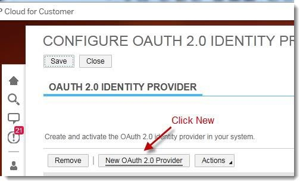

# Welcome to SAP HANA Cloud Platform, Portal Service - Partner Channel Management Configuration Guide

The SAP HANA Cloud Platform, portal service for Partner Channel Management configuration guide provides all you need to deploy a PCM solution on your HCP account and connect it to your SAP Cloud for Customer (C4C) tenant and SAP Cloud Identity (SCI) tenant.

## How to Deploy the Partner Channel Management Solution
This guide will show you how to download the partner channel management solution from the SAP HCP, portal service GitHub repository and deploy it to your account.

The Partner Channel Management solution includes several components:

*  pcmapps - an HTML5 application containing UI5 Components corresponding to C4C Business Objects such as Lead, Opportunity, Task etc. There are 3 types of applications: List, Object Details, and Create New Object.
*  pcmcpapps - an HTML5 application containing the following UI5 Applications: Self-Registration, Invitation, Registration and Status.
*  pcmsitetemplate - an HTML5 application containing a Site Template for creating a new Partner Channel Management site.
*  SAPID Mail Templates.zip -  a sample mail template for emails that will be sent after Self-Registration and Invitation.

##  1. Prerequisites

*	SAP HANA Cloud Platform (HCP) productive account (the solution does not work with a trial account)
*	Portal Service enabled from the HCP account cockpit, Services tab
*	SAP Cloud Identity (SCI) tenant
*	SAP Cloud for Customer (C4C) tenant
*	Users:
     -  Admin access to an HCP account
	 -  TENANT_ADMIN user for Portal Service
     -  C4C admin user
     - 	SCI admin user

## 2. Configure Your Account

### 2.1 	Deploy PCM artifacts
 1. Navigate to	[ https://github.com/SAP/hcp-portal-service-for-pcm/releases](https://github.com/SAP/hcp-portal-service-for-pcm/releases)
 2. Prepare content for deployment. There are two options:  
     a. Download ZIP files from the Releases folder.  
     b. Clone and Create a Zip file:  
         1.  	Clone the repository to your computer, or download it as a ZIP file by clicking the Clone or download button and selecting Download ZIP, and extract its contents.  
         2. 	Archive every folder content to ZIP files (pcmapps, pcmcpapps, pcmsitetemplate).

 3. Import the following ZIP files to your HCP account:
    * pcmapps.zip	(Business applications)
    * pcmcpapps.zip	(Invitation application)
    * pcmsitetemplate.zip	(Site template).

   You can import the files to SAP Web IDE and then deploy them to HCP, or you can directly deploy them to HCP through the HCP cockpit (Applications >>HTML5 Applications >> Import from File.  
   If the applications were deployed through HCP cockpit, they should be activated by clicking the link in the app's name, clicking on 'Versioning' in the left menu, 'Versions' under History section, and then on the activation icon in the 'Actions' column.  
 4. (Optional, if you imported the pcm applications via SAP Web IDE)
 	Preview your site template in SAP WEB-IDE:
	a. Open SAP Web IDE and right click on the 'pcmsitetemplates project'.  
	b. Choose Run -> Run as -> Preview Site Template.  

### 2.2	Import scilogin plugin
   1.	Go to [https://github.com/SAP/sap-hcp-portal-service-samples.](https://github.com/SAP/sap-hcp-portal-service-samples)
   2.	Download the ZIP file.
   3.	Extract it to your desktop.
   4.	Import sciloginplugin.zip to your account (using SAP Web IDE or through the HCP cockpit).

### 2.3 Create PCM roles
   1. Open the SAP HCP account cockpit and navigate to Services >> Portal Service >> Configure Portal Service >> Roles.
   2. Create the following new roles:
       * PartnerManager
       * PartnerContact
       * Applicant
       * Candidate

###  2.4 Create an email template in SCI
   The email template for the PCM invitation flow includes a SAP logo as well as pre-defined text. You may update the email template used by the SCI to send invitations to users according to your needs.
   
   1.	Download SAPID Mail Templates.zip from [ https://github.com/SAP/hcp-portal-service-for-pcm/releases](https://github.com/SAP/hcp-portal-service-for-pcm/releases)
   2.	Adjust the template according to your needs.
   3.   Open a BCP ticket BC-NEO-IAM. 
   4.	Attach the email templates to the BCP.

### 2.5	Set up a trust between the customer account and SCI (for log-on scenario)

#####  2.5.1	Customer HCP Account Settings
   1.	Open the customer HCP account cockpit, click on 'Security' and navigate to the Trust screen.
   2.	Edit the 'Local Service Provider' and change the Configuration Type to Custom.
   3.	Click the Generate Key Pair button to populate the Signing Key and Signing Certificate if they do not appear.
   4.	Change the 'Principle Propagation' value to 'Enabled'.
   5.	Save the settings and download the metadata by clicking on 'Get Metadata' link.
  	
   6.	Go to the 'Trusted Identity Provider' tab and click the Add Trusted Identity Provider link.
   7.	Browse and upload the IDP metadata file.

        TIP: You can get the IDP (SCI) metadata file by navigating to: https://<your SCI account name>.<accounts>.ondemand.com/saml2/metadata
	Open the above URL in Chrome and copy the entire text starting from <ns3… until the end. Then, paste it to a text file and save.  
	  
   8.	In the General tab, change the User ID Source to attribute, and then in the Source Value field, put mail.
   9.	In the Attributes tab, click Add Assertion-Based Attribute to add the following attributes mapping (after adding one pair, click the link again to add more input fields):

    Assertion Attribute |  Principle Attribute
    --- | ---
    first_name | firstname
    last_name  | lastname
    mail       | email

   10.	Save and close.

##### 2.5.2	SCI IDP Settings:
   1.	Open the admin page of your SCI IDP account. For example:
   https://<your SCI account name>.<accounts>.ondemand.com/admin/
   2.	Click Applications.
   3.	Add a new application and add the customer's name as the application name.
   4.	Open 'SAML 2.0 Configuration' section for your application and upload the customer's HCP account Service Provider metadata, which you downloaded already in section 2.5.1 step 5.
   5.	Save and close.

  You should now be able to log on to the portal service’s Admin Space with the user ID
  (email) that was assigned to it when the customer account was provisioned to the portal service.
  If the user cannot log in, make sure that the user was added to the SCI account (go to the SCI admin page and create the user via the User Management page or upload the user with his/her full details in a CSV file format. To see the required details, you can export a user to a CSV file and edit the file).

#### 2.6	Set up trust between the customer account and SCI API (for SAP ID invitation flow)
   1. Request a signed certificate from [SAP Support Portal](http://help.sap.com/disclaimer?site=https://support.sap.com/support-programs-services/services/trust-center/sso.html) (open in Internet Explorer only)
   2. Open a KeyStore Explorer application, and then do the following:
       1. Click on Create a new KeyStore.
       2. Choose JKS type.
       3. Go to Tools >> Import Key Pair.
       4. Choose PKCS #12.
       5. Enter the certificate password under Decryption Password, and choose the certificate file.
       6. Choose an alias (or leave the default).
       7. You are now requested to choose a new password - enter the original certificate password.
       8. Save the JKS file with the name sapid.jks. 
       9. When requested to choose a new password, choose the original certificate password again.
   3. In the customer HCP account, go to 'Connectivity' and then 'Destinations' and upload the JKS file using the 'Certificates' upload option.
   4. Open the SCI admin console and choose the customer application under 'Applications & Resources', go to the 'Certificate for API Authentication' section and upload the public part of the P12 certificate you created.   
   For getting the public part, do the following:
      1. Open IE only and go to Internet Options >> Content >> Certificates >> Import.
      2. Browse to the P12 file (switch the search format from X.509 to .p12).
      3. Type the password you chose when you created the certificate (leave check-boxes as default).
      4. Place the certificate in the Personal store and click on Next, then click on Finish.
      5. In IE, find the certificate you uploaded under the Personal store and click on the Export button.
      6. Click Next until you reach the file format options.
      7. Choose the Base-64 encoded X.509 (.CER) format and click Next.
      8. Choose a file name for the exported file and click Finish.
      9. Open the exported file with Notepad, and copy the entire text (including the header and footer).
      10. Paste the text into the proper section of SCI as described above.

#### 2.7	Set up trust between the customer account and SAP C4C backend (for C4C invitation flow)
   1. Log in to C4C backend with an Admin work center authorization.
     
   2. Under the Administrator section, go to Common Tasks and click on Configure OAuth 2.0 Identity Provider.  
     
   3. Create a new OAuth 2.0 Identity Provider.  
     
       You will see the following screen:  
         

   4. In a new browser, open the customer HCP account trust setting and fill out the required details:  
     
   5. Back in the Administrator section, click on OAUTH2.0 CLIENT REGISTRATION
   6. Create a new OAuth Client Registration as follows:
   	* Copy the 'Client ID' value to a Notepad. This value will later be used in the C4C destination.  
	* In 'Client Secret' add a password (remember it for future use)  
	* Description is optional. You can write the password for reference.  
	* In 'Issuer name' select the OAuth provider you created
	* Select the 'UIWC:CC_HOME' scope ID that appears in the Scope table  
   

#### 2.8	Upload destinations to customer HCP account

The destination file is created in your HCP account by opening the account's cockpit in the destination page and clicking on the "New Destination" button: https://account.[datacenter].hana.ondemand.com/cockpit#/acc/[account's name]/destinations    
The values in the destination fields are case sensitive, so please make sure to create the destinations based on the instructions below.  
  

##### 2.8.1	SAPID Destination  
Destination used for the invitation flow with SCI.  
  + Name = sapid
  + Type = HTTP
  + Description = (enter a description)
  + URL = (enter the URL to your SCI, https://<your SCI account name>.<accounts>.ondemand.com/)
  + ProxyType = Internet
  +	Authentication = ClientCertificateAuthentication
  + KeyStore Location = sapid.jks
  + KeyStore Password = (specify the certificate password)
  Additional property:
  Properties are added by clicking on "New Property" button  
  +	TrustAll = true (add this manually. Note that 'TrustAll' is the key and 'true' is its value.)

##### 2.8.2	C4C Destination  
oAuth C4C destination (used for connecting to the SAP C4C backend during partner flow) with the parameters in the next section.  
  + Name = C4C
  + Type = HTTP
  + Description = (enter description)
  + URL = (enter the full URL of your C4C tenant, E.g. https://myXXXXXX.crm.ondemand.com)
  + ProxyType=Internet
  + Authentication=OAuth2SAMLBearerAssertion
  + Audience = (same as the URL, without https://, E.g. myXXXXXX.crm.ondemand.com)
  + Client Key = (this should be taken from the client registration screen in C4C, under the Client ID field)  
  
  + Token Service URL = …/sap/bc/sec/oauth2/token (this relative path should come after the full URL to C4C tenant. Add your sap-client ID after the token, E.g. https://myXXXXXX.crm.ondemand.com/sap/bc/sec/oauth2/token?sap-client=073
Please contact your C4C contact to get the sap-client value)
  + Token Service User = (same value as of the client key)
  + Token Service Password = (the password you specified in C4C client registration)  
  Additional properties:  
  + authnContextClassRef = urn:oasis:names:tc:SAML:2.0:ac:classes:PreviousSession (add this manually)
  + nameIdFormat = urn:oasis:names:tc:SAML:1.1:nameid-format:emailAddress (add this manually)
  + scope = UIWC:CC_HOME (add this manually)  
  

##### 2.8.3	C4C__Public Destination  
Public C4C destination (used for connecting to the C4C backend during a guest registration scenario) with the parameters in the next section.  
+ Name = C4C__public (double underscore)
+ Type = HTTP
+ Description = (enter description)
+ URL = …/sap/byd/odata/v1/pcmportal (this relative path should come after the full URL to C4C tenant, E.g. https://myXXXXXX.crm.ondemand.com/sap/byd/odata/v1/pcmportal)
+ ProxyType=Internet
+ Authentication = BasicAuthentication
+ User = (admin user of the C4C tenant)
+ Password=<admin user password> (admin password of the C4C tenant)  
Additional properties:  
+ authnContextClassRef = urn:oasis:names:tc:SAML:2.0:ac:classes:PreviousSession (add this manually)
+ nameIdFormat = urn:oasis:names:tc:SAML:1.1:nameid-format:emailAddress (add this manually)
+ scope = UIWC:CC_HOME (add this manually)

#### 2.9	Configure SAP C4C Backend

##### 2.9.1	Purpose
This section describes how to create a Callback from the CRM that is used in the PCM scenario, to the Portal Service account.

The configuration is mandatory for enabling the entire self-registration scenario, including the transition between roles: Applicant -> Candidate -> Partner Manager.

Note that the Callback is configured on the CRM per HCP system, which means that only one HCP account can be configured.

##### 2.9.2	Instructions
   1.	Enter the C4C PCM CRM, for example: https://my312033.crm.ondemand.com, as an administrator.
   2.	Click the Administration tab and choose General Settings.
   3.	Click on Communication Systems under the 'Integration' section.
   4.	Create a new system with the following details:
            1. ID = PCM_PORTAL
            2. Host Name = [portal java application's name: cloudnwcportal or cloudsandboxportal]-[HCP account name].[data center, E.g. eu1, us1].hana.ondemand.com/, E.g. cloudnwcportal-aab4aef77.eu1.hana.ondemand.com/
            3. System Access Type = Internet
   5. Save the settings.
   6. Set Actions to Active.
   7. Click on Communication Arrangement.
   8. Click on New, and then do the following:
      1. Select Scenario: Choose the Channel Partner Registration Portal Callback option and click Next.
      2. Define Business Data: Choose the communication system you created in step 4, and click Next.
      3. Define Technical Data:
         1. Communication Method = Direct Connection.
         2. Application Protocol = Http.
         3. Authentication Method = User ID and Password.
         4. Click the Edit Credentials button and set the details (email address) of the TENANT_ADMIN user you have on HCP for the User ID (the user can be found in HCP - Services - Portal Service - Configure Portal Service - Roles).
      4. Review: Review and verify the accuracy of the data you filled in, then click on Finish and then Confirm
   9.	In the Communication Arrangement, click the entry of the new arrangement, then click Edit.
   10.	Switch to the Technical Data tab.
   11.	Click the Edit Advanced Settings button.
   12.	Make sure that the port is 443 and in the Path field add: portal/v1/services/invitations/continue_flow/
   13.	Click Save.

## 3. Create & Configure the PCM Site
1.	In the HCP cockpit, go to Services – Portal Service, and from there click on Go to Service. This opens the Site Directory of your portal service.
2.	Go to 'Site Directory' from the left menu and click on “+” to create a new site. Select the Partner Portal site template and click Create.
3.	In the Site Designer that opens, click "+" (at the bottom of the screen) and then “New App”.
4.	Select “sciloginplugin” from the list of apps, and click OK.
5.	In the Apps list on the left, click the cog icon next to the sciloginplugin app and edit the app as follows:
    + Set App Type to “Shell Plugin”.
    + In the Assigned Catalogs, add the catalog “Anonymous”.
6.	(Optional) Set site alias:
    + Go to site settings.
    + Click Edit and set site alias.
    + Click Save.
7.	Publish the site by clicking on the Publish button in the site header. This makes the site available for all users.
8.	The URL of the published site will be used later on for future actions.

## 4.	SAP C4C Documentation

[https://cp.hana.ondemand.com/dps/d/preview/0cec219614e94fd3bdd0f0561e9b70e0/1511/en-US/frameset.htm?b7027a7e846f4cbf9391d6a475c24ce5.html ](https://cp.hana.ondemand.com/dps/d/preview/0cec219614e94fd3bdd0f0561e9b70e0/1511/en-US/frameset.htm?b7027a7e846f4cbf9391d6a475c24ce5.html )

